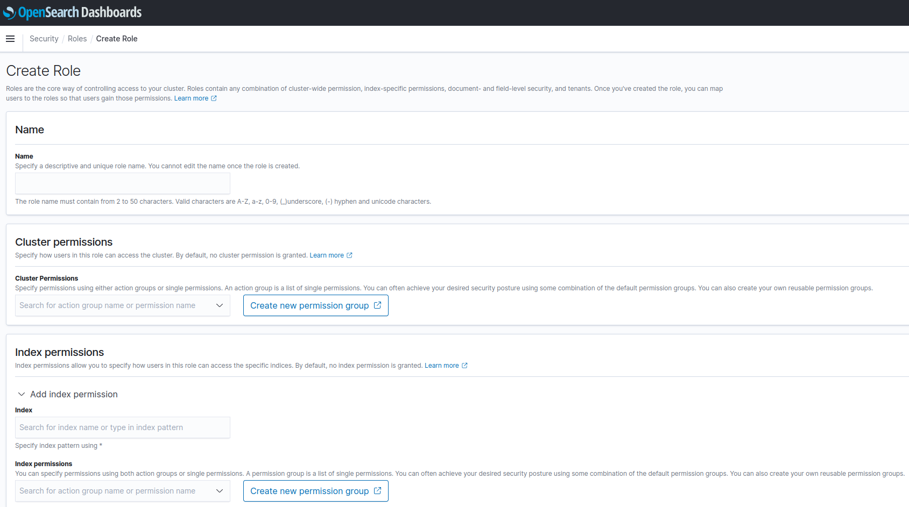
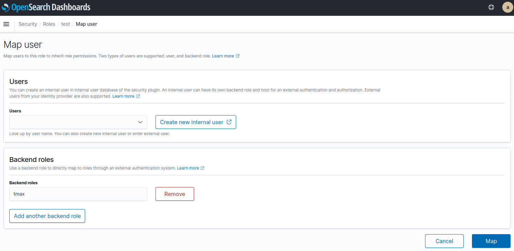
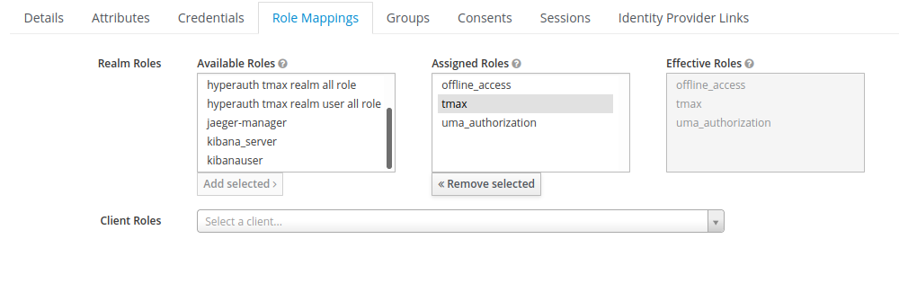
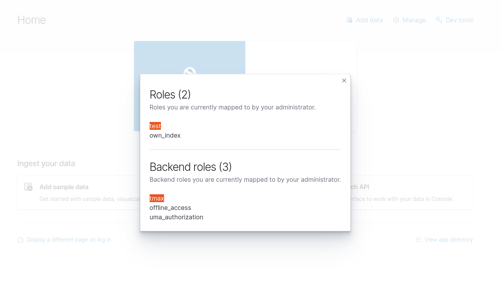

# Hyperauth-Opensearch 유저별 권한(roles) 설정 가이드
* 목적: Opensearch Dashboards에서 Custom role을 생성하여 hyperauth 유저에게 매핑 적용을 통해 접근 권한을 설정한다.
* 유저 권한을 설정하기 위해서는 admin 권한을 가진 사용자로 로그인해야한다.
  
### Step 1. Dashboards UI에서 Custom Role 생성
* Dashboards UI 메뉴에서 Security > Roles > Create Role을 클릭하여 Custom Role을 생성할 수 있다.
* 예시) Custom role "test" 생성
   * Name: 생성하고자 하는 Custom Role 이름
   * Cluster permissions: 클러스터 단위에서의 접근 권한
   * Index permissions: 인덱스 단위에서의 접근 권한, 특정 인덱스 패턴에 대한 접근 권한을 각각 지정할 수 있다.
   * Tenant permissions: 대시보드 내 스페이스(global 또는 private)에 대한 접근 권한

### Step 2. Custom Role을 Backend Role로 Mapping 적용
* Security > Roles> 생성한 Custom role을 클릭 > Mapped users > Manage mapping을 클릭한다.
* Backend roles에 Hyperauth에서 realm roles로 적용할 이름을 작성한 후 Map을 클릭한다.
* 예시) Backend roles "tmax"로 등록

### Step 3. Hyperauth 사용자에게 Role-Mapping 적용
* Hyperauth > Roles > Add Role로 Backend roles로 설정한 값과 동일한 이름으로 role을 생성한다.
* 해당 권한을 부여할 사용자의 Role Mappings 설정에서 Realm roles에 생성한 role을 적용한다.

* Dashboard에 새로 권한을 부여한 사용자 계정으로 로그인한다.
* 오른쪽 상단에 있는 계정 메뉴에서 "View roles and identities"를 클릭하여, 예시와 같이 새로 생성한 role이 적용되어 있는 것을 확인한다.

