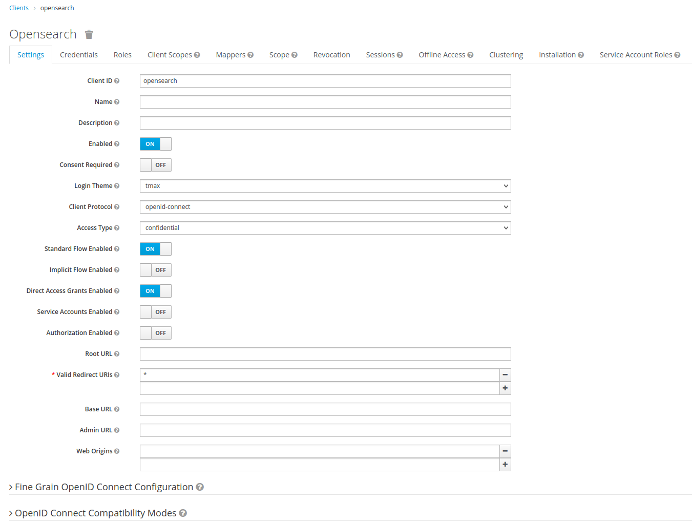
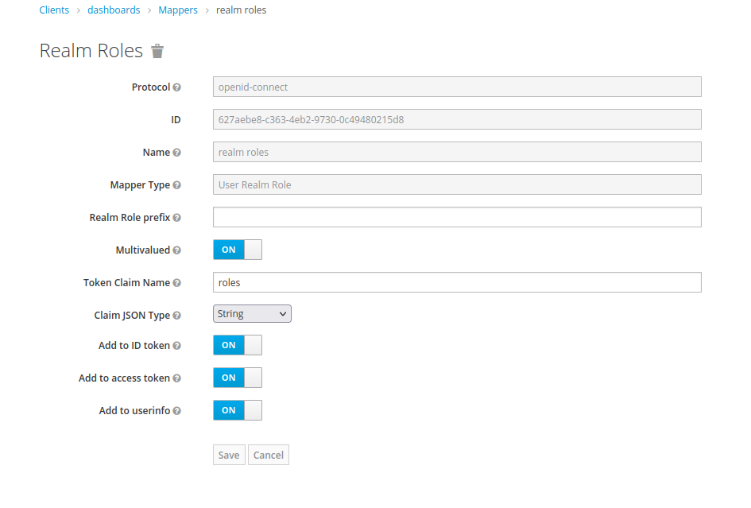
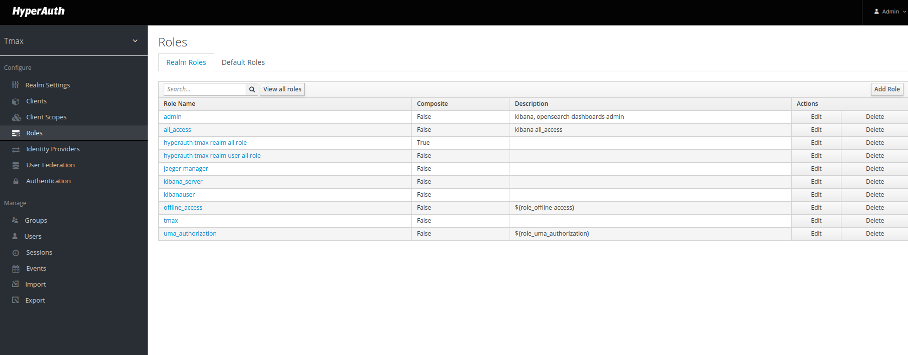
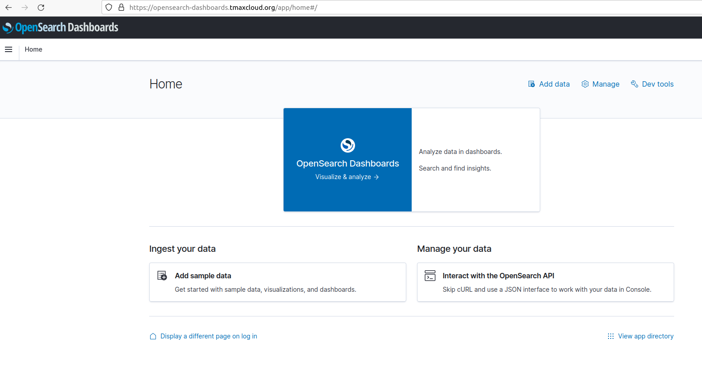
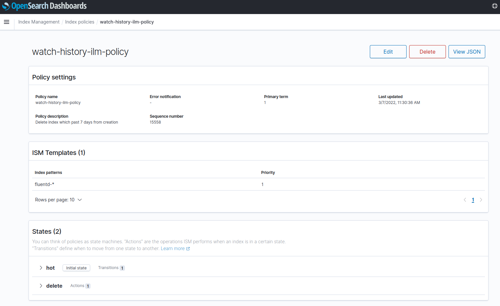
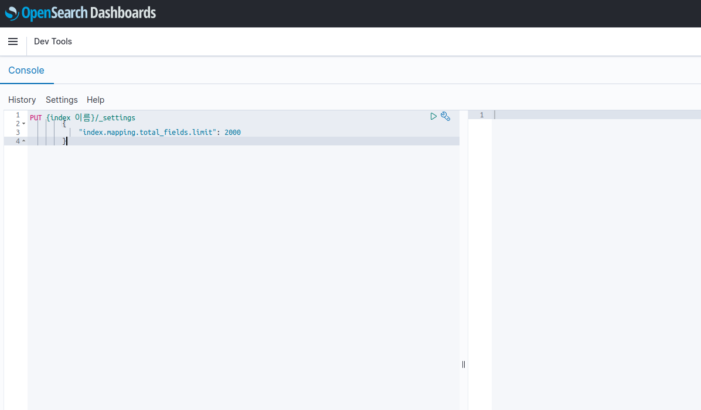
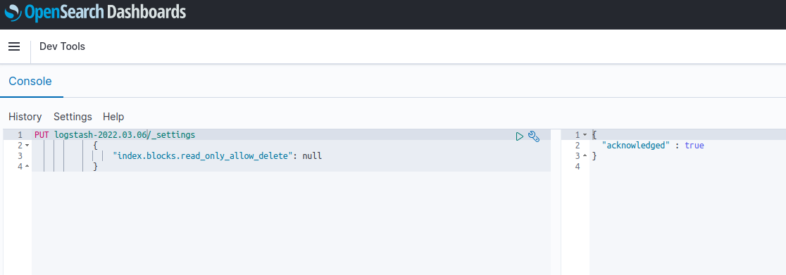

# Opensearch 설치 가이드

## 구성 요소 및 버전
* Opensearch ([opensearchproject/opensearch:1.2.3](https://hub.docker.com/r/opensearchproject/opensearch))
* Opensearch dashboard ([opensearchproject/opensearch-dashboards:1.2.0](https://hub.docker.com/r/opensearchproject/opensearch-dashboards))
* Busybox ([busybox:1.32.0](https://hub.docker.com/layers/busybox/library/busybox/1.32.0/images/sha256-414aeb860595d7078cbe87abaeed05157d6b44907fbd7db30e1cfba9b6902448?context=explore))
* Fluentd ([fluent/fluentd-kubernetes-daemonset:v1.4.2-debian-elasticsearch-1.1](https://hub.docker.com/layers/fluent/fluentd-kubernetes-daemonset/v1.4.2-debian-elasticsearch-1.1/images/sha256-ce4885865850d3940f5e5318066897b8502c0b955066392de7fd4ef6f1fd4275?context=explore))
* Rightsizing Plugin ([docker.io/tmaxcloudck/rightsizing-opensearch-plugin:demo](https://hub.docker.com/repository/docker/tmaxcloudck/rightsizing-opensearch-plugin))

## Prerequisites
* 필수 모듈
  * [RookCeph](https://github.com/tmax-cloud/hypersds-wiki/) 
  * [Hyperauth](https://github.com/tmax-cloud/hyperauth)

## 폐쇄망 설치 가이드
* 설치를 진행하기 전 아래의 과정을 통해 필요한 이미지 및 yaml 파일을 준비한다.
* 그 후, Install Step을 진행하면 된다.
1. 사용하는 image repository에 Opensearch 설치 시 필요한 이미지를 push한다. 

    * 작업 디렉토리 생성 및 환경 설정
    ```bash
    $ mkdir -p ~/opensearch-install
    $ export OS_HOME=~/opensearch-install
    $ cd $OS_HOME
    $ export OS_VERSION=1.2.3
    $ export DASHBOARD_VERSION=1.2.0
    $ export PG_IMAGE_PATH=rightsizing-opensearch-plugin:demo
    $ export BUSYBOX_VERSION=1.32.0
    $ export FLUENTD_VERSION=v1.4.2-debian-elasticsearch-1.1
    $ export REGISTRY={ImageRegistryIP:Port}
    ```
    * 외부 네트워크 통신이 가능한 환경에서 필요한 이미지를 다운받는다.
    ```bash
    $ sudo docker pull opensearchproject/opensearch:${OS_VERSION}
    $ sudo docker save opensearchproject/opensearch:${OS_VERSION} > opensearch_${OS_VERSION}.tar
    $ sudo docker pull opensearchproject/opensearch-dashboards:${DASHBOARD_VERSION}
    $ sudo docker save opensearchproject/opensearch-dashboards:${DASHBOARD_VERSION} > dashboard_${DASHBOARD_VERSION}.tar
    $ sudo docker pull busybox:${BUSYBOX_VERSION}
    $ sudo docker save busybox:${BUSYBOX_VERSION} > busybox_${BUSYBOX_VERSION}.tar
    $ sudo docker pull docker.io/tmaxcloudck/${PG_IMAGE_PATH}
    $ sudo docker save docker.io/tmaxcloudck/${PG_IMAGE_PATH} > ${PG_IMAGE_PATH}.tar
    $ sudo docker pull fluent/fluentd-kubernetes-daemonset:${FLUENTD_VERSION}
    $ sudo docker save fluent/fluentd-kubernetes-daemonset:${FLUENTD_VERSION} > fluentd_${FLUENTD_VERSION}.tar
    ```
  
2. 위의 과정에서 생성한 tar 파일들을 폐쇄망 환경으로 이동시킨 뒤 사용하려는 registry에 이미지를 push한다.
    ```bash
    $ sudo docker load < opensearch_${OS_VERSION}.tar
    $ sudo docker load < dashboard_${DASHBOARD_VERSION}.tar
    $ sudo docker load < busybox_${BUSYBOX_VERSION}.tar
    $ sudo docker load < ${PG_IMAGE_PATH}.tar
    $ sudo docker load < fluentd_${FLUENTD_VERSION}.tar
    
    $ sudo docker tag opensearchproject/opensearch:${OS_VERSION} ${REGISTRY}/opensearchproject/opensearch:${OS_VERSION}
    $ sudo docker tag opensearchproject/opensearch-dashboards:${DASHBOARD_VERSION} ${REGISTRY}/opensearchproject/opensearch-dashboards:${DASHBOARD_VERSION}
    $ sudo docker tag busybox:${BUSYBOX_VERSION} ${REGISTRY}/busybox:${BUSYBOX_VERSION}
    $ sudo docker tag docker.io/tmaxcloudck/${PG_IMAGE_PATH} ${REGISTRY}/${PG_IMAGE_PATH}
    $ sudo docker tag fluent/fluentd-kubernetes-daemonset:${FLUENTD_VERSION} ${REGISTRY}/fluentd-kubernetes-daemonset:${FLUENTD_VERSION}
    
    $ sudo docker push ${REGISTRY}/opensearchproject/opensearch:${OS_VERSION}
    $ sudo docker push ${REGISTRY}/opensearchproject/opensearch-dashboards:${DASHBOARD_VERSION}
    $ sudo docker push ${REGISTRY}/busybox:${BUSYBOX_VERSION}
    $ sudo docker push ${REGISTRY}/${PG_IMAGE_PATH}
    $ sudo docker push ${REGISTRY}/fluentd-kubernetes-daemonset:${FLUENTD_VERSION}
    ```

## Step 0. opensearch.config 설정
* 목적 : `yaml/opensearch.config 파일에 설치를 위한 정보 기입`
* 순서: 
	* 환경에 맞는 config 내용 작성
		* OS_VERSION
			* OpenSearch 의 버전
			* ex) 1.2.3
		* DASHBOARD_VERSION
			* Opensearch-Dashboards 의 버전
			* ex) 1.2.0
		* BUSYBOX_VERSION
			* Busybox 의 버전
			* ex) 1.32.0
        * HYPERAUTH_URL
            * Hyperauth 의 URL
            * ex) hyperauth.tmaxcloud.org
        * DASHBOARD_CLIENT_SECRET
            * Hyperauth 에 생성된 dashboards client 의 secret
            * ex) 22a985f7-c12d-4812-bd4e-bd598e1df7e8
        * RS_PLUGIN
            * OpenSearch-Dashboards의 Rightsizing plugin 사용 유무, boolean
            * ex) true
        *  PG_IMAGE_PATH
            * OpenSearch-Dashboards Plugin 이미지 레포와 버전
            * ex) rightsizing-opensearch-plugin:demo
        *  CUSTOM_DOMAIN_NAME
            * Ingress로 접근 요청할 사용자 지정 도메인 이름
            * ex) tmaxcloud.org
		* FLUENTD_VERSION
			* FLUENTD_VERSION 의 버전
			* ex) v1.4.2-debian-elasticsearch-1.1
		* BUSYBOX_VERSION
			* BUSYBOX_VERSION 의 버전
			* ex) 1.32.0
		* STORAGECLASS_NAME
			* OpenSearch가 사용할 StorageClass 의 이름
            * {STORAGECLASS_NAME} 그대로 유지시 default storageclass 사용
			* ex) csi-cephfs-sc
		* REGISTRY
			* 폐쇄망 사용시 image repository의 주소
			* 폐쇄망 아닐시 {REGISTRY} 그대로 유지
			* ex) 192.168.171:5000
## Hyperauth 연동
* 목적: `Opensearch-dashboards와 Hyperauth 연동`
* 순서:
    *  hyperauth에서 client 생성
    	* Client protocol = openid-connect
    	* Access type = confidential 
    	* Standard Flow Enabled = On 
    	* Direct Access Grants Enabled = On
    	* Service Accounts Enabled = On
    	* Valid Redirect URIs: '*'
    * Client > dashboards > Credentials > client_secret 복사 후 DASHBOARD_CLIENT_SECRET을 채운다.
    * Client > dashboards > Mappers > add builtin 클릭 후 'realm roles'에 체크하여 Add selected 클릭
    * Client > dashboards > Mappers > realm roles 선택 후 설정 변경
    	* Token Claim Name = roles
    	* Add to ID token = On
    	* Add to access token = On
    	* Add to userinfo = On
    * Roles > Realm Roles > add role 클릭 후 'admin' role 생성
    * Dashboard를 사용하고자 하는 사용자의 계정의 Role Mappings 설정에서 Realm Roles에 admin을 적용한다.

    * client 생성
    
    * mapper 생성
    
    * Realm role
    

## Step 1. installer 실행
* 목적 : `설치를 위한 shell script 실행`
* 순서: 
	* 권한 부여 및 실행
	``` bash
	$ sudo chmod +x yaml/install.sh
	$ sudo chmod +x yaml/uninstall.sh
	$ ./yaml/install.sh
	```

## 비고
* Dashboard의 서비스 타입 변경을 원하는 경우
    * yaml/02_opensearch-dashboards.yaml 파일에서 Service의 spec.type 수정

## 삭제 가이드
* 목적 : `삭제를 위한 shell script 실행`
* 순서: 
	* 실행
	``` bash
	$ ./yaml/uninstall.sh
	```

## 수동 설치 가이드
## Prerequisites
1. Namespace 생성
    * Opensearch를 설치할 namespace를 생성한다.
    ```bash
    $ kubectl create ns kube-logging
    ```
2. 변수 export
    * 다운 받을 버전을 export한다. 
    ```bash
    $ export OS_VERSION=1.2.3
    $ export DASHBOARD_VERSION=1.2.0
    $ export FLUENTD_VERSION=v1.4.2-debian-elasticsearch-1.1
    $ export BUSYBOX_VERSION=1.32.0
    $ export PG_IMAGE_PATH=rightsizing-opensearch-plugin:demo
    $ export STORAGECLASS_NAME=csi-cephfs-sc
    ```
    * Hyperauth 연동 관련 및 기타 스펙을 export 한다.
    ```bash
    $ export RS_PLUGIN=true #disable 시 false
    $ export HYPERAUTH_URL=hyperauth.tmaxcloud.org
    $ export DASHBOARD_CLIENT_SECRET=22a985f7-c12d-4812-bd4e-bd598e1df7e8
    $ export CUSTOM_DOMAIN_NAME=tmaxcloud.org
    ```
3. Plugin 설정을 위한 plugin-setting.sh를 실행한다.
   ```bash
   $ sudo chmod +x yaml/plugin-setting.sh
   $ ./yaml/plugin-setting.sh
   ```
* 비고  
    * 이하 인스톨 가이드는 StorageClass 이름이 csi-cephfs-sc 라는 가정하에 진행한다.
    * 재설치 시 Rightsizing plugin 설정을 변경할 경우
        * ex) rightsizing plugin disable로 변경 시 
        * export RS_PLUGIN=false 로 변수를 새로 export 후 plugin-setting.sh을 실행한다.

## Install Steps
0. [Opensearch yaml 수정](https://github.com/chaejin-lee/install-opensearch/blob/master/README.md#step-0-opensearch-yaml-%EC%88%98%EC%A0%95)
1. [OpenSearch 설치](https://github.com/chaejin-lee/install-opensearch/blob/master/README.md#step-1-opensearch-%EC%84%A4%EC%B9%98)
2. [OpenSearch-Dashboards 설치](https://github.com/chaejin-lee/install-opensearch/blob/master/README.md#step-2-opensearch-dashboards-%EC%84%A4%EC%B9%98)
3. [Fluentd 설치](https://github.com/chaejin-lee/install-opensearch/blob/master/README.md#step-3-fluentd-%EC%84%A4%EC%B9%98)

## Step 0. opensearch-stack yaml 수정
* 목적 : `opensearch-stack yaml에 이미지 registry, 버전 및 노드 정보를 수정`
* 생성 순서 : 
    * 아래의 command를 사용하여 사용하고자 하는 image 버전을 입력한다.
	```bash
	$ sed -i 's/{BUSYBOX_VERSION}/'${BUSYBOX_VERSION}'/g' 01_opensearch.yaml
	$ sed -i 's/{OS_VERSION}/'${OS_VERSION}'/g' 01_opensearch.yaml
	$ sed -i 's/{HYPERAUTH_URL}/'${HYPERAUTH_URL}'/g' 01_opensearch.yaml
	$ sed -i 's/{STORAGECLASS_NAME}/'${STORAGECLASS_NAME}'/g' 01_opensearch.yaml
    $ sed -i 's/{DASHBOARD_VERSION}/'${DASHBOARD_VERSION}'/g' 02_opensearch-dashboards.yaml
    $ sed -i 's/{PG_IMAGE_PATH}/'${PG_IMAGE_PATH}'/g' 02_opensearch-dashboards.yaml
    $ sed -i 's/{HYPERAUTH_URL}/'${HYPERAUTH_URL}'/g' 02_opensearch-dashboards.yaml
    $ sed -i 's/{DASHBOARD_CLIENT_SECRET}/'${DASHBOARD_CLIENT_SECRET}'/g' 02_opensearch-dashboards.yaml
    $ sed -i 's/{CUSTOM_DOMAIN_NAME}/'${CUSTOM_DOMAIN_NAME}'/g' 02_opensearch-dashboards.yaml
	$ sed -i 's/{FLUENTD_VERSION}/'${FLUENTD_VERSION}'/g' 03_fluentd.yaml
  	$ sed -i 's/{FLUENTD_VERSION}/'${FLUENTD_VERSION}'/g' 03_fluentd_cri-o.yaml
	```
* 비고 :
    * `폐쇄망에서 설치를 진행하여 별도의 image registry를 사용하는 경우 registry 정보를 추가로 설정해준다.`
	```bash
	$ sed -i 's/docker.io\/opensearchproject\/opensearch/'${REGISTRY}'\/opensearchproject\/opensearch/g' 01_opensearch.yaml
	$ sed -i 's/busybox/'${REGISTRY}'\/busybox/g' 01_opensearch.yaml
	$ sed -i 's/docker.io\/opensearchproject\/opensearch-dashboards/'${REGISTRY}'\/opensearchproject\/opensearch-dashboards/g' 02_opensearch-dashboards.yaml
	$ sed -i 's/docker.io\/tmaxcloudck/'${REGISTRY}'/g' 02_opensearch-dashboards.yaml
	$ sed -i 's/fluent\/fluentd-kubernetes-daemonset/'${REGISTRY}'\/fluentd-kubernetes-daemonset/g' 03_fluentd.yaml
	$ sed -i 's/fluent\/fluentd-kubernetes-daemonset/'${REGISTRY}'\/fluentd-kubernetes-daemonset/g' 03_fluentd_cri-o.yaml
	```    
    
## Step 1. OpenSearch 설치
* 목적 : `OpenSearch 설치`
* 생성 순서 : 
    * [01_opensearch.yaml](yaml/01_opensearch.yaml) 실행
	```bash
	$ kubectl apply -f 01_opensearch.yaml
	```     
* 비고 :
    * StorageClass 이름이 csi-cephfs-sc가 아니라면 환경에 맞게 수정해야 한다.

## Step 2. OpenSearch-Dashboards 설치
* 목적 : `Opensearch의 UI 모듈인 Opensearch-Dashboards를 설치`
* 생성 순서 : [02_opensearch-dashboards.yaml](yaml/02_opensearch-dashboards.yaml) 실행 
    ```bash
    $ kubectl apply -f 02_opensearch-dashboards.yaml
    ```

* 비고 :
    * Dashboard pod 가 running 임을 확인한 뒤 https://dashboards.${CUSTOM_DOMAIN_NAME}/ 에 접속한다.
    * Hyperauth에서 설정한 사용자 계정으로 로그인하여 정상 작동을 확인한다.

## Step 3. fluentd 설치
* 목적 : `EFK의 agent daemon 역할을 수행하는 fluentd를 설치`
* 생성 순서 : 03_fluentd~.yaml 실행  
  1. Container Runtime이 cri-o 인 경우  
    * [03_fluentd_cri-o.yaml](yaml/03_fluentd_cri-o.yaml) 실행
      ``` bash
      $ kubectl apply -f 03_fluentd_cri-o.yaml
      ```
  2. Container Runtime이 docker 인 경우  
    * [03_fluentd.yaml](yaml/03_fluentd.yaml) 실행 
      ```bash
      $ kubectl apply -f 03_fluentd.yaml
      ```
  3. Kubernetes pod 별로 index 생성하고자 할 경우
    * [03_fluentd_multiple_index.yaml](yaml/03_fluentd_multiple_index.yaml) 실행 
      ```bash
      $ kubectl apply -f 03_fluentd_multiple_index.yaml
      ```
## 비고
* Fluentd에서 수집하는 로그 필드 설정
    * fluentd.yaml 파일 Configmap의 kubernetes.conf에 filter 설정을 추가로 적용하여 로그 필드를 삭제할 수 있다.
    * 주의: 삭제된 로그 필드는 opensearch에 적재되지 않는다.
    * 예시) kubernetes.container_image_id에 대한 로그 필드를 삭제
    ```
    <filter kubernetes.**>
      @type record_transformer
      enable_ruby true
      remove_keys $.kubernetes.container_image_id
    </filter>

    ```
* Index management policy 설정
    * watch-history-ilm-policy는 생성된 지 7일이 지난 인덱스는 자동으로 삭제한다.
    * policy를 수정하고 싶다면, Opensearch-dashboards에서 아래와 같이 Index Management > Index Policies 메뉴를 들어가서 watch-history-ilm-policy를 클릭한다.
    * 해당 페이지에서 Edit 버튼을 클릭하여 policy를 커스터마이징 후, Update를 클릭한다.
    
    * 변경된 policy가 기존 index에 적용되지 않은 경우
        * Index Management > Managed Indices > Change Policy를 클릭
        * 변경된 policy를 적용하려는 indices를 설정
        * New Policy에 watch-history-ilm-policy 적용 후 Change 클릭

* OpenSearch에 HTTP 콜 하는 방법
    * Opensearch-dashboards Management 메뉴에서 Dev Tools를 클릭한다.
    * HTTP 콜 작성 후 ▶ 버튼 클릭
    

* 에러 해결법
    * Limit of total fields [1000] in index 에러
        * 원인 : 저장하려는 field 갯수가 index의 field limit보다 큰 경우
        * 해결 : index.mapping.total_fields.limit 증가 HTTP 콜 실행
        ```
        PUT {index 이름}/_settings
        {
            "index.mapping.total_fields.limit": 2000
        }
        ```
    * index read-only 에러
        * 원인 : 디스크 사용량이 flood-stage watermark 수치를 넘어서면 OS가 자동적으로 저장을 막음 (default 값은 95%)
        * 해결 (택1)
            * 필요없는 인덱스를 삭제해서 용량 확보
            	* dev-tools에서 HTTP 콜을 통해 인덱스 삭제
            	* ex) DELETE logstash-2022.01.01

            * HTTP콜을 통해 read-only 해제하기
            
            ```
            PUT /{index 이름}/_settings
            {
                "index.blocks.read_only_allow_delete": null
            }
            ```

## Hyperauth CA 수동 설정
* 목적: cert-manager 오류로 tmaxcloud-ca가 갱신되어 기존에 생성된 hyperauth에 적용중인 ca 인증서와 달라졌을 경우, 
       hyperauth ca 인증서를 수동으로 설정하여 opensearch와 연동.
* 순서: 
1. [hyperauth-ca.yaml](yaml/hyperauth-ca.yaml)를 hyperauth에서 적용 중인 hyperauth-https-secret의 ca.crt로 수정한다.
2. hyperauth-ca.yaml을 실행
``` bash
$ kubectl apply -f hyperauth-ca.yaml
```
3. [01_opensearch.yaml](yaml/01_opensearch.yaml)와 [02_opensearch-dashboards.yaml](yaml/02_opensearch-dashboards.yaml)의 볼륨 설정 및 config 파일을 수정한다.

* ex) 01_opensearch.yaml/statefulset 주석 해제
```
volumeMounts:
- name: hyperauth-ca
  mountPath: /usr/share/opensearch/config/certificates/hyperauth
  readOnly: true
volumes:
- name: hyperauth-ca
  secret:
    secretName: hyperauth-ca
```
opensearch-securityconfig
```
pemtrustedcas_filepath: /usr/share/opensearch/config/certificates/hyperauth/ca.crt # 로 수정
```
* ex) 02_opensearch-dashboards.yaml/deployment 주석 해제
```
volumeMounts:
- name: hyperauth-ca
  mountPath: /usr/share/opensearch-dashboards/config/certificates/hyperauth
  readOnly: true
volumes:
- name: hyperauth-ca
  secret:
    secretName: hyperauth-ca
```
opensearch-dashboards-config
```
  opensearch_security.openid.root_ca: /usr/share/opensearch-dashboards/config/certificates/hyperauth/ca.crt #로 수정
```
4. 이후 install 가이드와 동일한 순서로 설치를 진행
