# Opensearch 기본 가이드

### Opensearch Stack 기본 구조
* Opensearch stack은 Fluentd - Opensearch - Opensearch-Dashboards로 구성되어 있다.
* Fluentd를 통해 k8s cluster 로그를 수집하여 Opensearch에 적재하면 Dashboards를 통해 로그를 시각화하여 볼 수 있다.
* Fluentd를 통해 수집한 log data는 Opensearch와 연동된 pvc에 적재하여 관리한다.

## 시나리오 1: Index 생성 및 로그 조회
* Fluentd를 통해 로그가 Opensearch에 적재가 잘 되고 있는지 확인하고 discover를 통해 로그의 상세 내역을 조회할 수 있다.

### Step 1. refresh 설정을 통한 index 생성 조회
* 목적: Opensearch의 indices에서는 실시간으로 조회가 갱신되지 않으므로 Refresh 시간을 1 sec로 설정하여 index 생성 및 로그 적재 현황을 확인한다.
* 시계 형태를 클릭하여 Refresh every 를 1 seconds로 설정 후 Start를 클릭한다.
* refresh 설정을 멈추고자 할 때 Stop 버튼을 클릭한다.
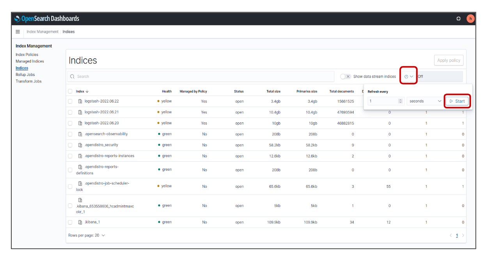

* indices 조회 화면에서 확인할 수 있는 내용은 다음과 같다.
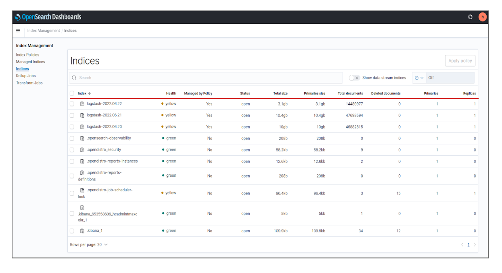
* Index : opensearch에 적재된 index name
* #### Health : index shard 상태 (green/yellow/red) : shard 상태가 red일 경우 복구될 때까지 기다리거나, 복구할 수 없는 경우 삭제해야 한다.
* Managed by Policy:  index policy 적용 여부
* Status: index 상태 (open/close) : open 상태가 아니라면 해당 index에 log data를 적재할 수 없는 상태이다.
* Total size: index의 모든 shard에 저장된 data size
* Primaries size: index의 primary shard에 저장된 data size
* #### Total documents: index에 적재된 총 document 수 : 실질적으로 로그가 들어오고 있는지 확인할 수 있는 지표
    * #### 해당 log의 mapping data만 들어온 경우 total documents의 숫자가 늘어나지 않고 total size만 늘어나는 경우도 있다.
* Deleted documents: index에서 삭제된 document 수
* Primaries: index의 총 primary shard 수 : 현재 default로 1로 설정
* Replicas: index의 총 replica shard 수 : 현재 default로 1로 설정

### Step 2. index pattern 생성
* 목적: 적재된 로그 내용을 시각화를 통해 조회하기 위한 index pattern을 생성한다.
* pattern name을 설정할 때 정규식을 이용하여 해당 index를 포함하는 index pattern을 생성한다. 
    * 특정 index만 조회하고자 할 경우 해당 index name과 동일한 이름으로 생성할 수 있다.
* Index와 Index pattern의 차이:
    * Index : Opensearch에 적재된 log data
    * Index pattern: index data를 시각화하기 위한 log field의 data type mapping 정보
    *  #### index pattern을 지워도 log data는 index에 저장되어 있어 data가 삭제되지는 않는다.
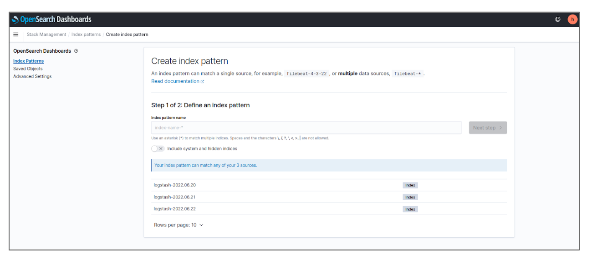

* Time field는 @timestamp로 설정하여 Create index pattern을 클릭한다.
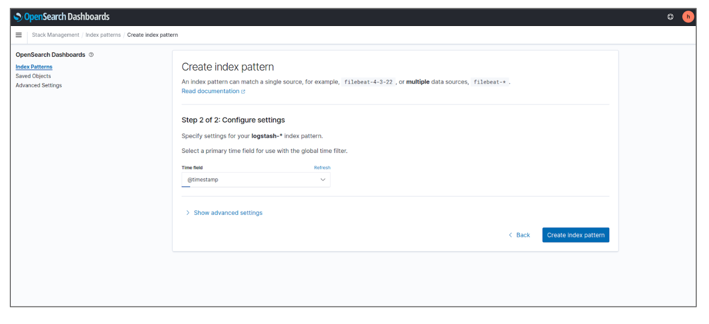

### Step 3. discover를 통한 로그 조회
* 목적: 생성한 index pattern을 바탕으로 opensearch에 적재된 log data를 조회한다.
* Discover에서 index-pattern을 선택하여 로그를 조회한다.
* default로 설정된 조회 기간은 ‘15분 전부터 현재까지’이며 원하는 기간을 직접 지정하여 조회할 수 있다.
* 조회된 log 순서는 time 내림차순이다.

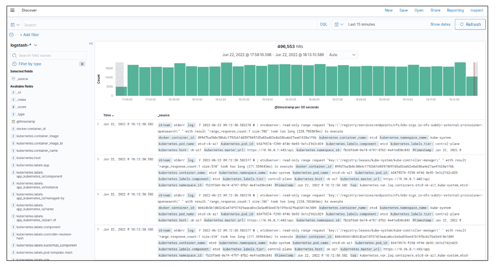

#### discover의 filter를 이용한 특정 로그 조회
* 목적: filter 기능을 통해 원하는 로그를 조회할 수 있다.
* +Add filter를 클릭한다.
* Field에서 조건을 설정할 log field를 선택한다.
* Operator에서 is / is not, is one of / is not one of, exists / does not exist 중 원하는 조건을 선택한다.
* Value는 해당 조건에 맞는 값을 설정한다.
* ex) namespace가 monitoring인 로그만 조회
    * Field: kubernetes.namespace_name / Operator: is / Value: monitoring 

#### discover의 available fields
* 목적: 조회 화면에서 원하는 log field에 해당하는 내용만 간략하게 조회할 수 있다.
* ex) Available fields 중 ‘log’의 +를 클릭했을 때 조회 화면
    * 조회된 내용 중 Time과 log 만 discover 화면에 뜨는 것을 확인.
    * 각 로그의 왼쪽에 있는 ‘>’ 를 클릭하면 해당 로그의 상세 내용을 확인할 수 있다.
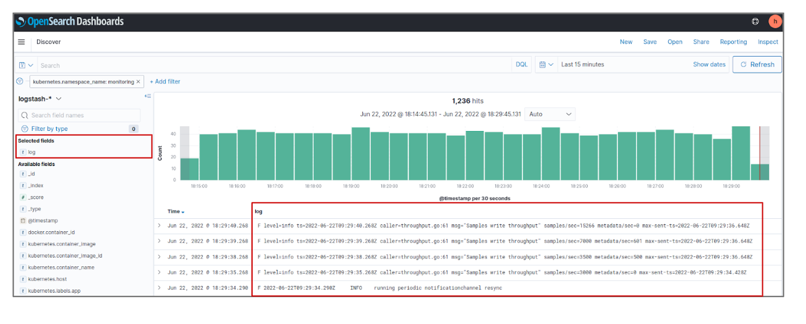

## 시나리오 2: Index Policy 설정
* Index policy 설정을 통해 index lifecycle을 효율적으로 관리할 수 있다.

### Step 1. index policy 수정하기
* 목적: Index Policy 기능을 통해 Index의 삭제 주기를 default 7일에서 3일로 변경한다.
* 변경하고자 하는 Index Policy의 이름을 체크하여 Edit을 클릭, Visual editor를 선택하여 진행한다.
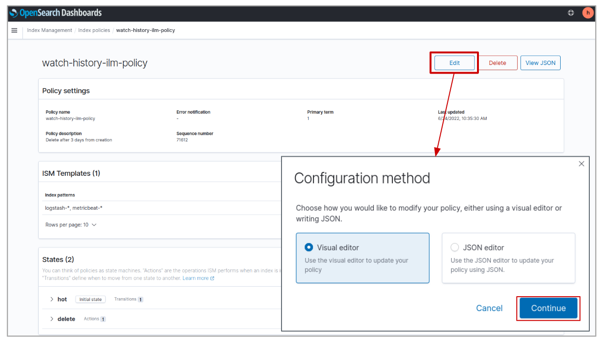

* 삭제 주기 변경을 위하여 hot state 옆의 연필 아이콘을 클릭한다.
* 비고:
    * Description : Policy에 대한 설명을 추가할 수 있다.
    * Index patterns: Policy를 적용할 index pattern을 설정한다.
    * States : 상태 별로 index에 대한 변경, 삭제를 추가할 수 있다.
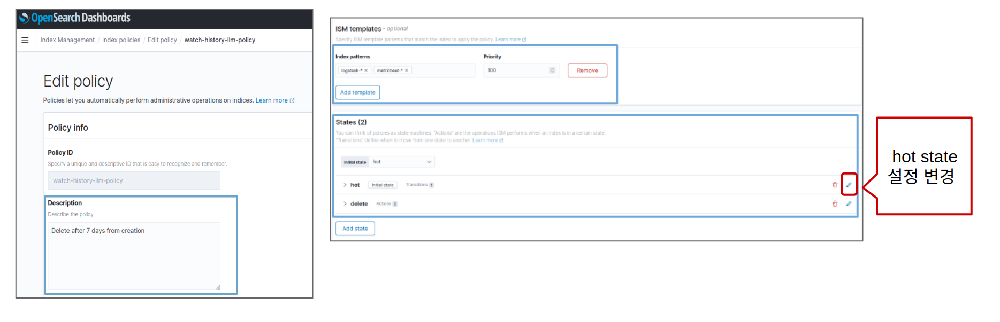

* Hot state에서 Transitions 설정을 클릭한다.
* Minimum index age를 3d으로 수정하여 transition 설정을 저장하고 update state을 클릭한다.
* Edit 화면으로 돌아와서 Update를 클릭하면 policy 내용이 갱신된 것을 확인할 수 있다.
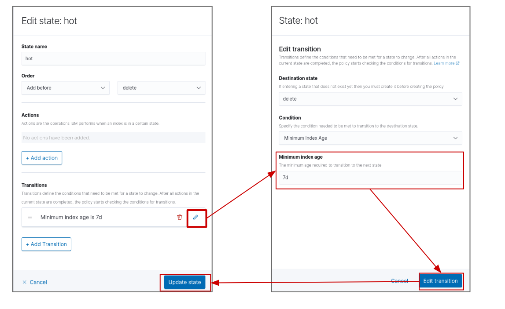

### Step 2. 변경된 index policy 적용하기
* 목적: Index Policy 수정 후 기존 policy가 적용된 index에 대하여 갱신된 policy로 update한다.
* Managed lndices에서 Change policy를 클릭한다.
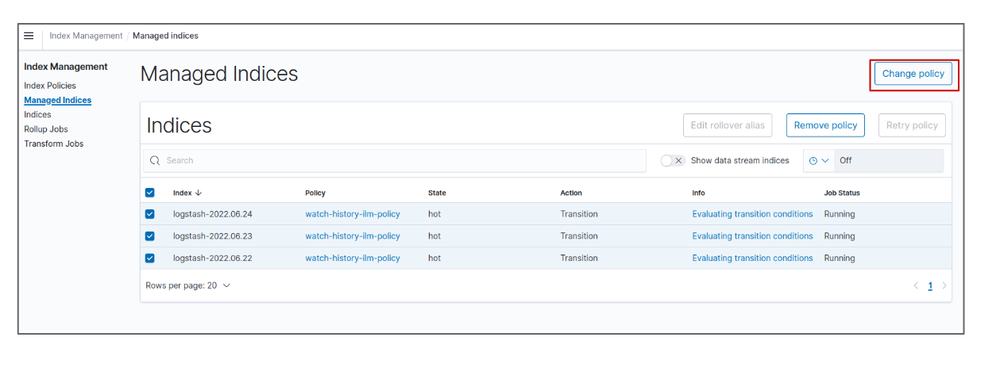

* Managed Indices에서 적용하고자 하는 index name을 입력한다.
    * 정규식 적용이 가능하다. ex) logstash-**
* New policy에서 적용하려는 index policy를 클릭 후 Change를 클릭한다.
* 이후 하단에 policy 변경 완료 문구가 뜨면 적용 완료.
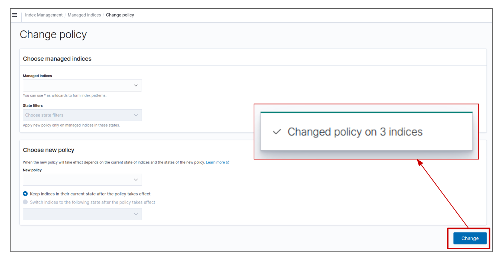

* Managed Indices에서 index에 매핑한 policy 이름을 클릭하면 변경된 policy로 적용된 것을 확인할 수 있다.
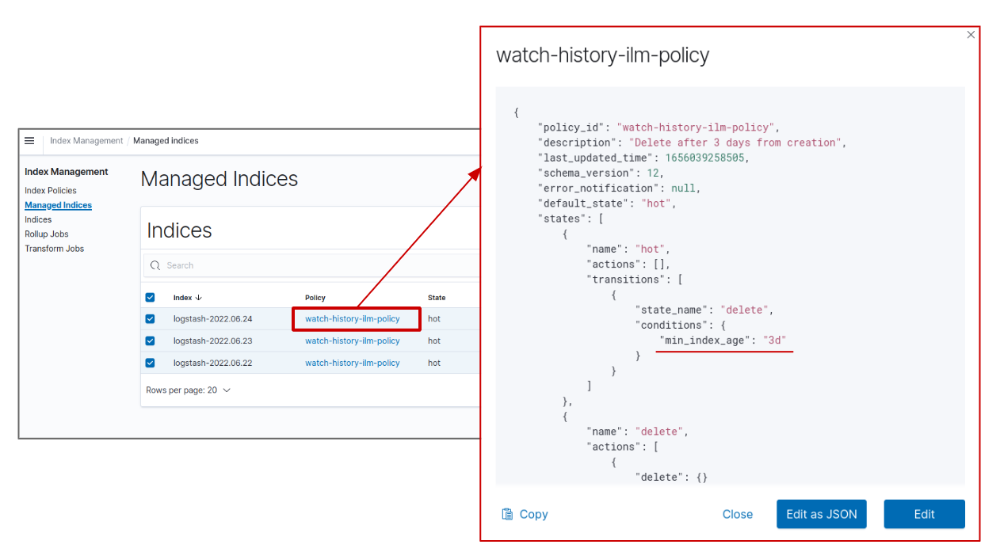
