# Opensearch Plugin 가이드
* Opensearch Plugin 가이드는 Opensearch-Dashboards UI를 통해 접근할 수 있는 plugin을 기준으로 한다.
* Opensearch Plugins 중 Index Management와 Security의 경우 다른 가이드 문서에 작성되어 있기 때문에 제외한다.
   * index management의 index policy는 Opensearch 기본 가이드로 제공
   * security 기능은 Opensearch Role 설정 가이드로 제공 
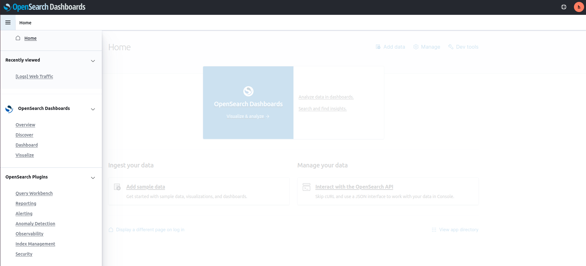

## 목차
* [Query Workbench](https://github.com/tmax-cloud/install-opensearch/blob/main/docs/README-plugin.md#query-workbench)
* [Anomaly Detection](https://github.com/tmax-cloud/install-opensearch/blob/main/docs/README-plugin.md#anomaly-detection-%EC%9D%B4%EC%83%81-%ED%83%90%EC%A7%80) 
* [Alerting](https://github.com/tmax-cloud/install-opensearch/blob/main/docs/README-plugin.md#alerting-%EC%95%8C%EB%A6%BC)
* [Observability](https://github.com/tmax-cloud/install-opensearch/blob/main/docs/README-plugin.md#observability-%EA%B4%80%EC%B8%A1)
* [Reporting](https://github.com/tmax-cloud/install-opensearch/blob/main/docs/README-plugin.md#reporting)

## Query Workbench
* 목적: Opensearch에서 기존의 Opensearch DSL이 아닌 SQL 구문으로 쿼리를 작성하여 원하는 정보를 조회하고 그 결과를 text, json, jdbc, csv 형식으로 저장할 수 있다.
* Query editor에 SQL로 쿼리를 작성 후 RUN을 클릭하면 Results에서 조회된 결과를 확인 할 수 있다.
* Download 버튼을 클릭하면 조회된 내용을 JSON, JDBC, CSV, Text 형식으로 저장하여 다운로드 할 수 있다.
* 비고:
   * opensearch-dashboards 1.2.X version에서는 multiline을 지원하지 않아 쿼리문은 한 줄로 작성해야한다.
   * 일부 지원하지 않는 내용이 있다. 참조: https://opensearch.org/docs/1.2/search-plugins/sql/limitation/

* ex) SELECT * FROM logstash-2022.07.01
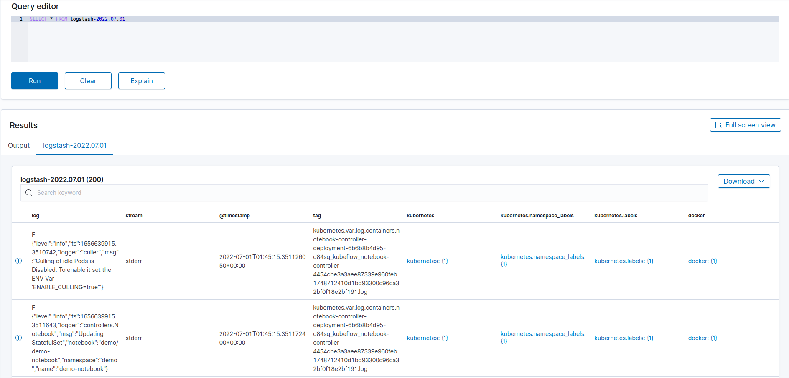

## Anomaly Detection 이상 탐지
* 목적: time-series 데이터에서 Random Cut Forest(RCF) 알고리즘을 통해 사용자가 설정한 detector를 바탕으로 이상 현상을 감지한다.
* Detector(탐지기)를 생성한다
   * Detector details: detector 이름과 description을 작성한다.
   * Data Source: detector로 감시할 index 또는 index-pattern을 설정한다.
      * data filter를 통해 특정 label만 감시할 수 있도록 추가 설정이 가능하다.
   * Timestamp를 설정한다
   * Operation settings: detector가 이상 현상을 감시하는 주기를 설정할 수 있다. interval이 작을 수록 detector의 감지 결과는 real time에 더 가까워진다.
      * window delay: 데이터 수집 프로세스에 걸리는 시간과 detecor가 감지하는 데이터의 양을 조절하기 위해 delay를 추가로 설정할 수 있다. 
   * Custom result index: detector가 감지한 결과를 바탕으로 새로운 index를 생성할 수 있다.
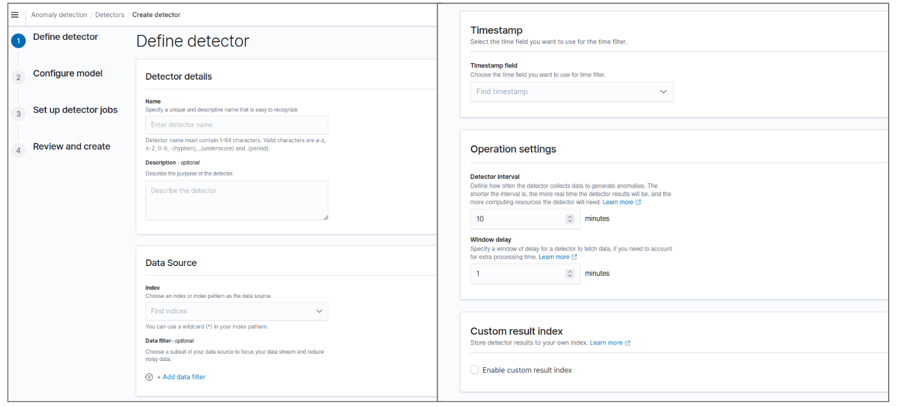 
* Model을 설정한다
   * Features: 이상 현상을 탐지하고자 하는 index의 log field를 설정하여 average(), count(), sum(), min(), max() 중 하나의 집계 메소드를 선택한다.
   * Categorical fields: 이상 현상을 특정 키워드나 ip field type으로 카테고리화 할 수 있다. detector가 생성된 이후에는 변경할 수 없다.
   * Sample anomalies: 데이터 샘플을 통해 현재 설정된 detector 설정을 바탕으로 이상 탐지 preview를 볼 수 있다.
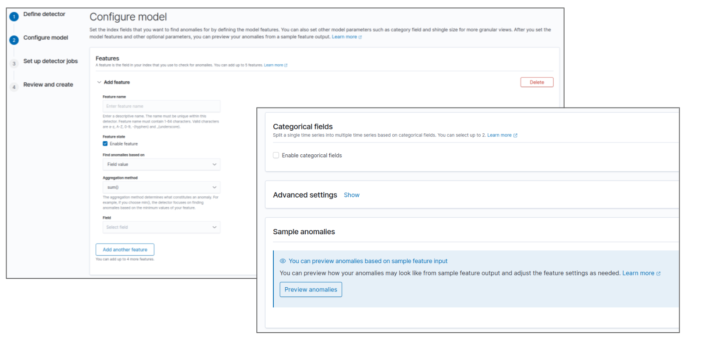
* Detector job을 설정한다
   * Real-time detection: 권장 사항으로 이상 탐지를 실시간으로 진행한다.
   * Historical analysis detection: 실시간이 아닌 오랜 기간(몇 주 또는 몇 달)동안 적재된 데이터를 바탕으로 이상 현상에 대한 분석을 하고자 할 때 설정한다.
      * default로 설정된 기간은 1달 
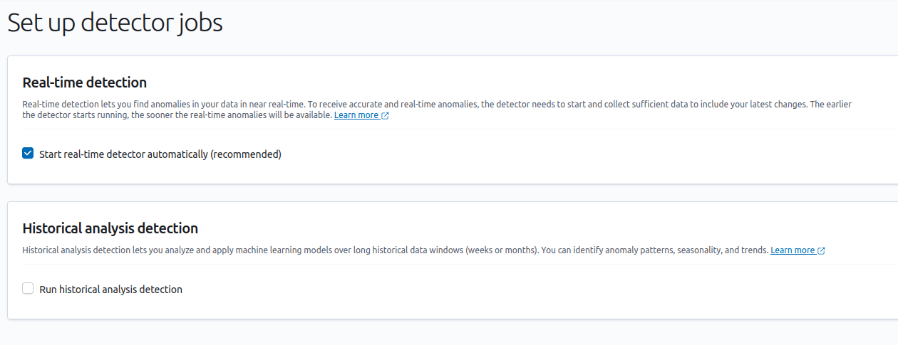

* 생성된 detector가 initializing에서 running 상태로 바뀌면 Dashboard 메뉴를 통해 현황을 조회할 수 있다.
ex) opensearch에서 제공하는 sample data(sample-host-health-detector)를 이용한 cpu와 memory 사용량 이상 탐지 모니터링
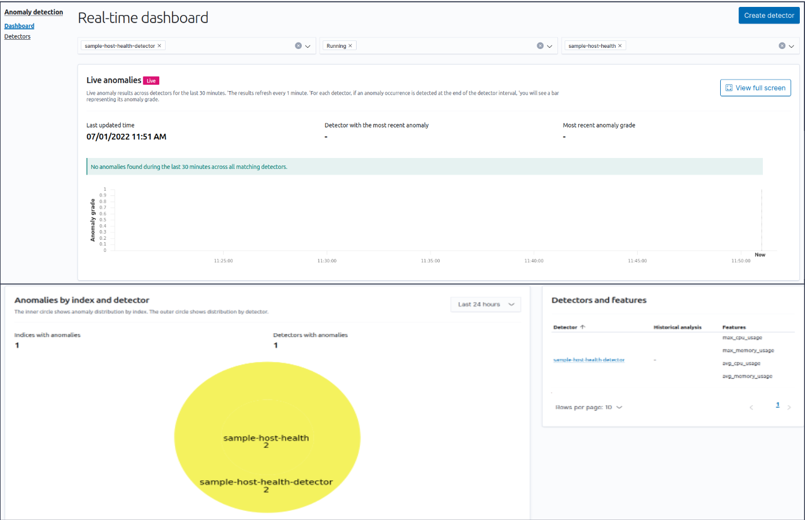

## Alerting 알림
* 목적: opensearch에 적재되는 index data가 특정 조건을 충족하면 알림을 수신할 수 있다.
* Destinations에서 Add destination 클릭
   * Name: destination 이름 설정
   * Type: Amazon chime, Slack, Email, Custom Webhook
   * Slack의 경우, Settings에 Slack API에서 workspace에 slack app을 생성하여 incoming webhook 설정을 통해 받은 Webhook URL을 입력한다.
      * Slack app 설정 참고: https://api.slack.com/messaging/webhooks
   * Email의 경우, Sender와 Recipients 설정이 필요하다.
      * Sender: sender name, email address, SMTP host, port 입력 후 encryption method를 설정한다. (default로 None)
      * Recipients:  email group을 생성하여 추가한다. email group에는 group name과 alerting을 보내고자하는 email(복수 가능)을 입력하여 생성한다.
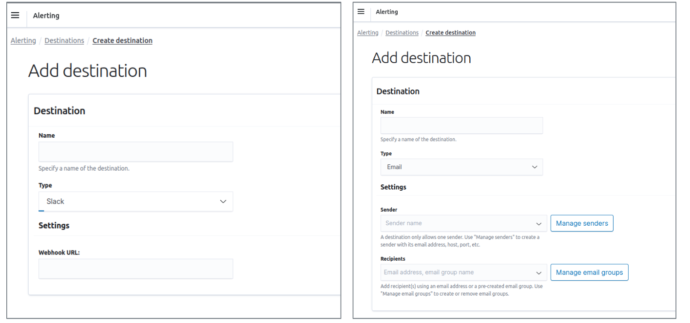

* Monitors에서 Create monitor 클릭
* ex) Alerting을 anomaly detector를 이용하여 Slack으로 알림을 수신하는 예시

   * Monitor details:
      * Monitor name: monitor 이름 설정
      * Monitor type: Per query monitor, Per bucket monitor 중 하나를 선택
      * Monitor defining method: 쿼리와 트리거를 정의하기 위한 옵션. visual editor, extraction query editor, anomaly detector 중 하나를 선택
      * Schedule: monitor가 데이터를 수집하여 알림을 수신하는 주기를 설정할 수 있다.
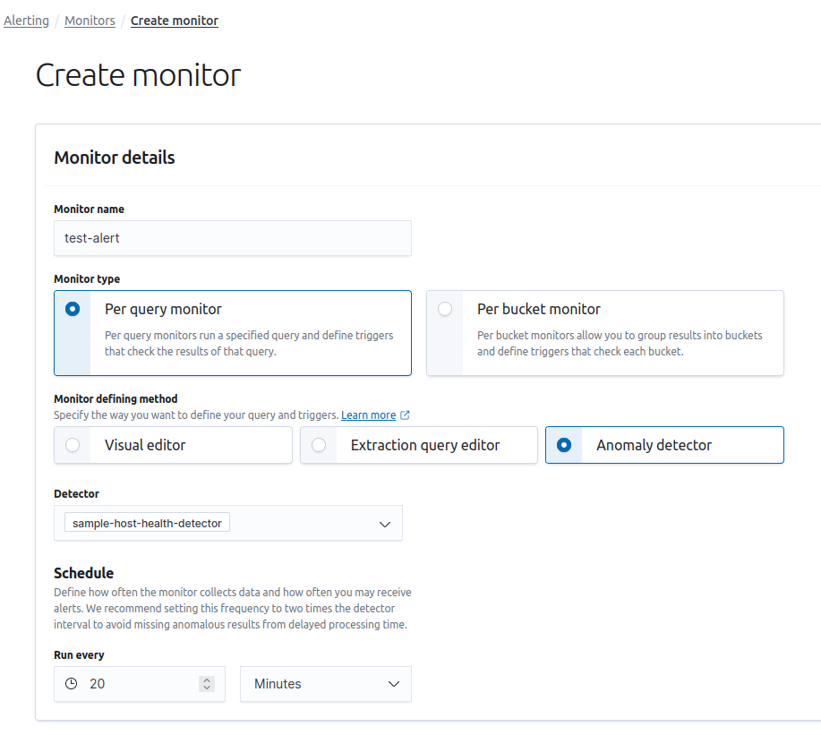

   * Triggers: 알림을 수신하기 위한 조건을 설정한다.
      * trigger type: anomaly detector의 설정을 가져오거나 query response를 설정할 수 있다.
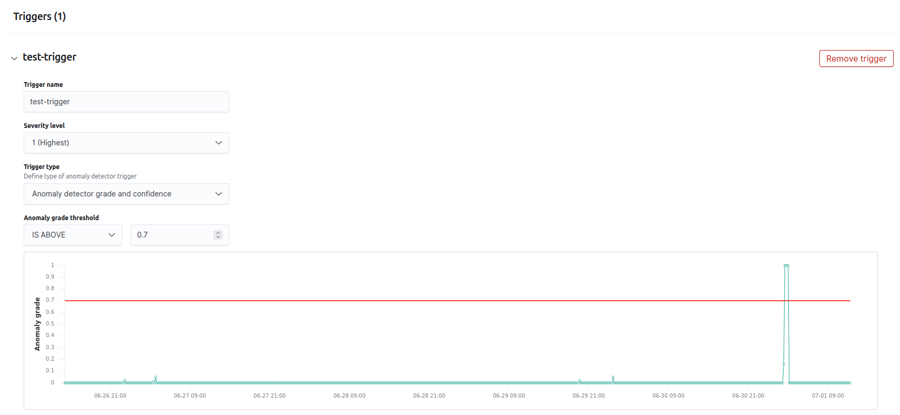

   * Actions: 알림을 수신할 Destination과 Message 형식을 설정한다
   * Send test message를 클릭하면 slack app을 연동한 workspace에 action에서 설정한 형식의 message가 수신되는 것을 확인할 수 있다. 
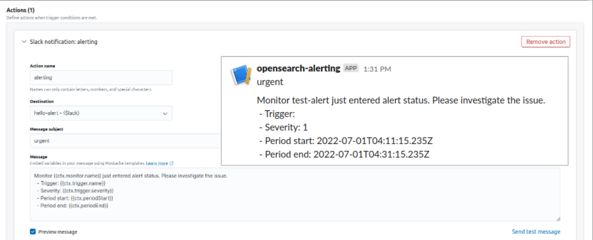

* 생성된 monitor를 통해 alert history를 조회 및 해당 alert이 수신된 내역을 확인할 수 있다.
* ex) opensearch에서 제공하는 sample data(sample-host-health-detector)를 이용한 cpu와 memory 사용량 이상 탐지에 대한 알림 수신
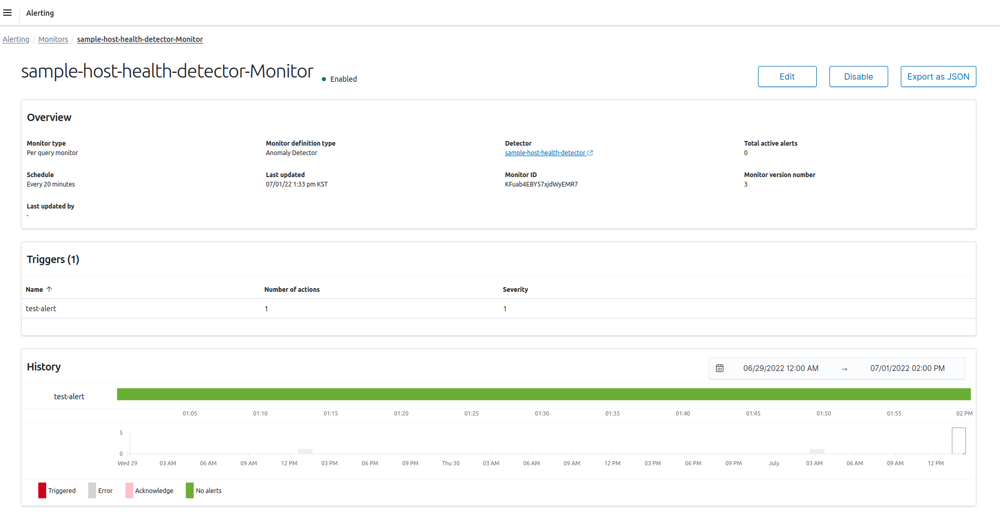
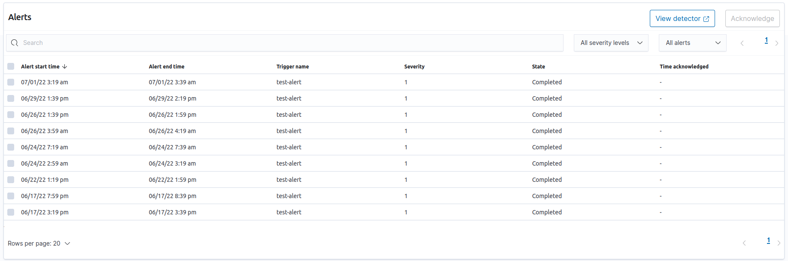

## Observability 관측
### Trace analytics: Elastic APM과 같이 Opentelemetry를 통해 application으로부터 trace 데이터를 수집하여 분석할 수 있다.
* OpenTelemetry를 통해 trace data를 수집하고 Data prepper를 통해 Opensearch의 document 형식에 맞게 변환하여 Opensearch에 적재하면 대시보드를 통해 시각화된 분석 결과를 확인한다.
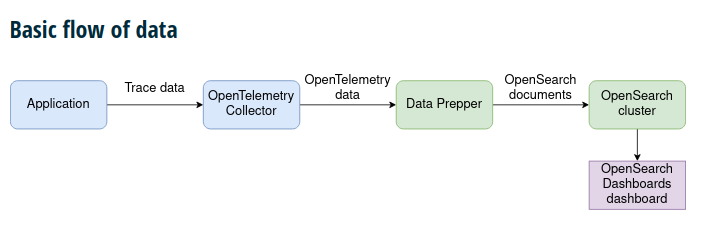

### Trace analytics 사용 예시
* Dashboard 화면을 통해 해당 Application의 trace group(Http 콜을 기준)의 Latency, Error rate, Throughput 정보를 확인할 수 있다.

   * trace 메뉴에서 Time spent by service 및 trace group을 기준으로 한 Span 정보를 확인할 수 있다.
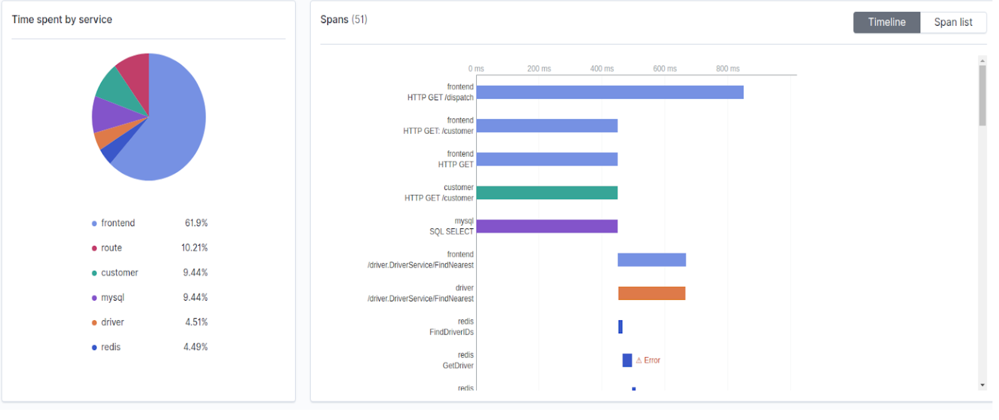

   * Services 메뉴에서 각 서비스 별 latency, error rate, throughput 정보와 연결된 서비스 정보를 확인할 수 있다.
      * service 중 하나를 클릭하면 해당 서비스에 대한 Span 세부 정보를 확인할 수 있다.
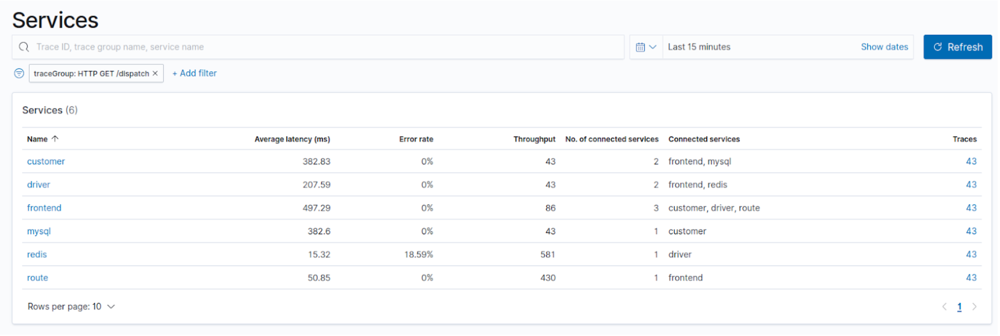
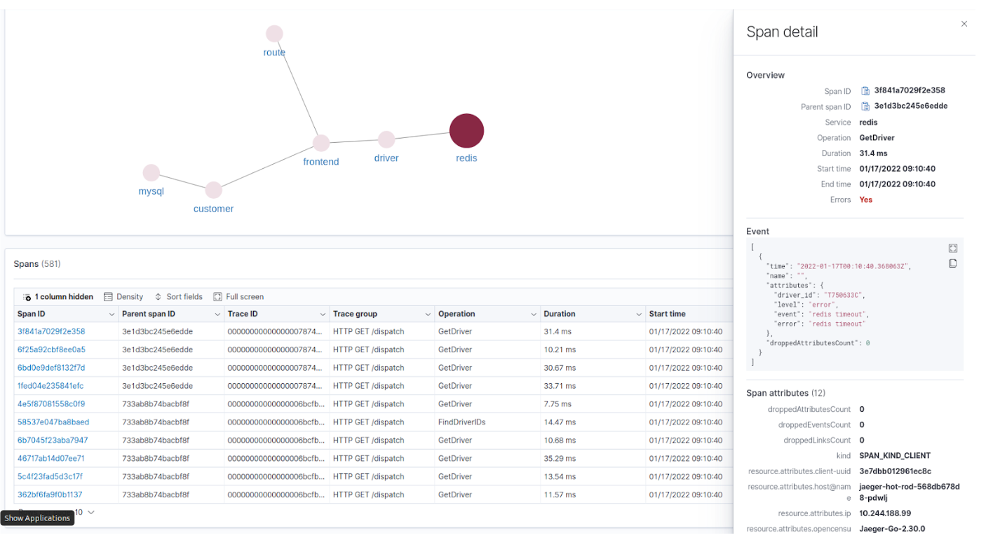

### Piped Processing Language(PPL): 
* 파이프(|) syntax를 사용하는 opensearch에서 제공하는 DSL 이외에 추가로 적용된 쿼리 언어
* ex) 'source = opensearch_dashboards_sample_data_logs | fields host | stats count()' 
* 입력 시 조회한 데이터 상에서 host address에 대한 count 결과를 보여준다.
 
### Event Analytics: PPL 쿼리를 이용한 데이터 시각화 제공
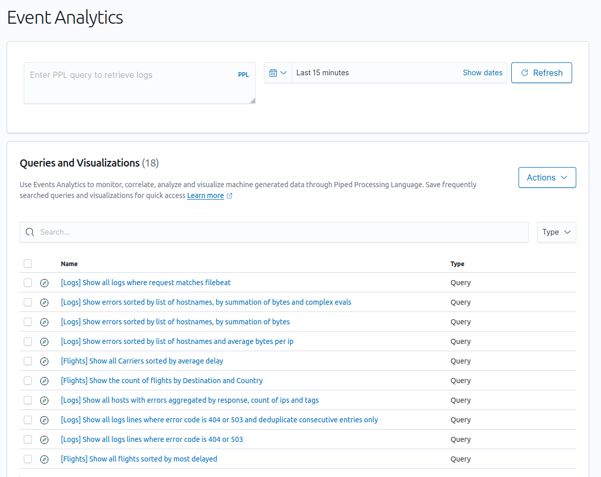
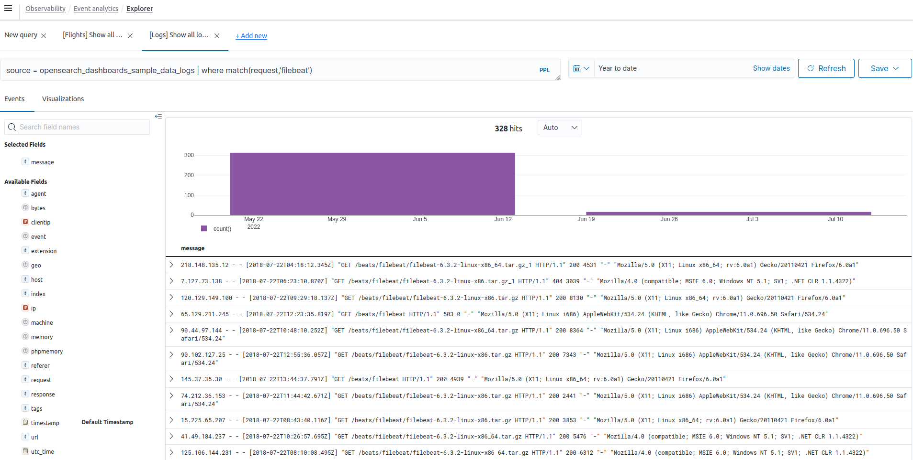

### Operational panels: Event Analytics에서 쿼리로 생성한 visualization을 이용하여 대시보드를 제공한다.

### Notebooks: code block(Markdown/SQL/PPL)과 visualization 데이터를 결합할 수 있는 단일 인터페이스
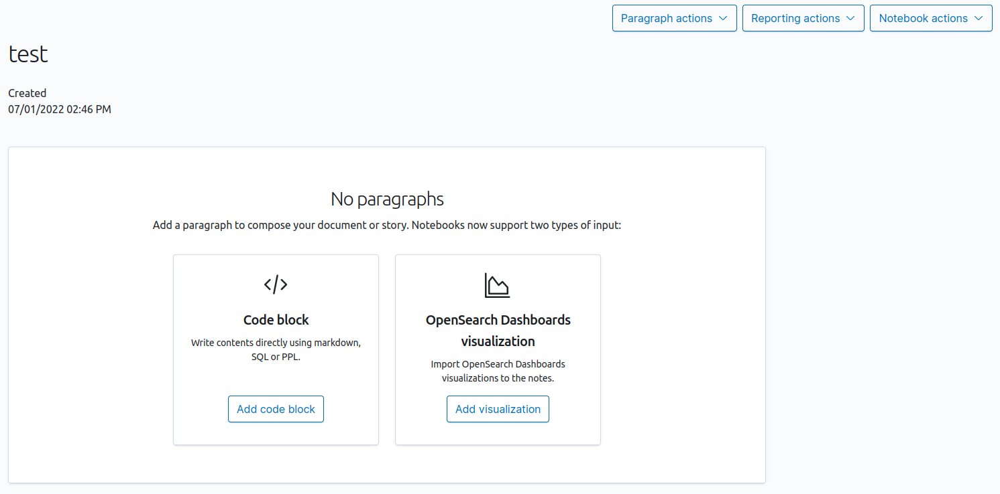

## Reporting
* 목적: Opensearch Dashboard의 Discovery, Dashboard, Visualization, Notebooks를 통해 report를 생성하여 PNG, PDF, CSV 형식으로 다운로드 할 수 있다.
* report definition 생성
   * Report source: report로 내보낼 source를 선택한다. Dashboard, Visualization, Saved search(discovery에서 특정 기간을 설정하여 조회한 데이터), Notebook
   * File format: dashboard, Visualization, Notebook은 PDF 혹은 PNG 중에 선택, Saved search는 csv 형식으로 고정된다.
   * Time range: 특정 기간동안 수집된 데이터를 설정한다
   * Report trigger: on demand와 schedule을 설정할 수 있다.
      * schedule로 설정 시, 주기적으로 report를 생성하도록 설정할 수 있다.   
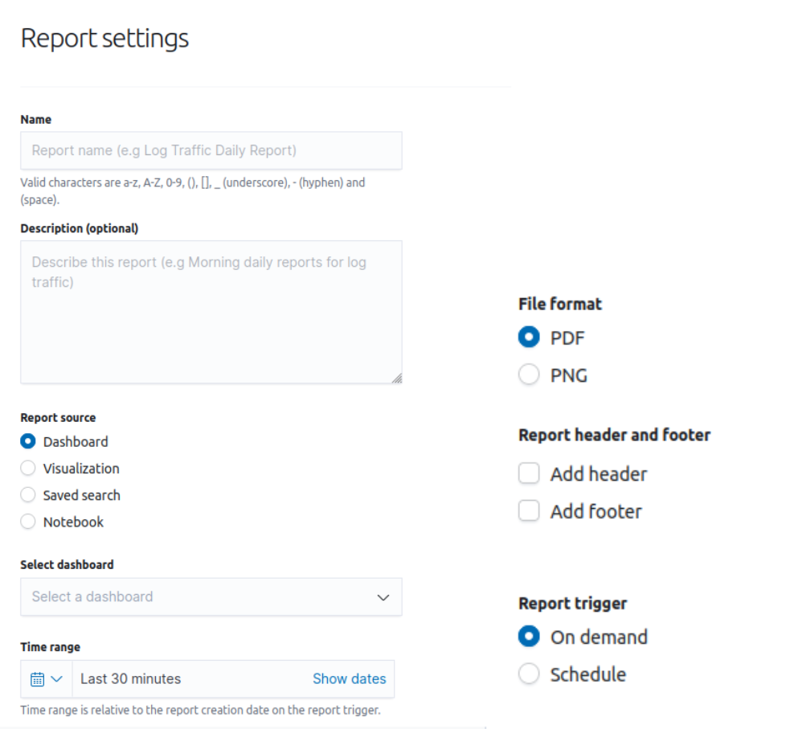

* report definition 적용 후 예시
* 생성된 report에서 Generate의 다운로드 버튼을 클릭하면 사용자의 PC에 해당 파일을 저장할 수 있다
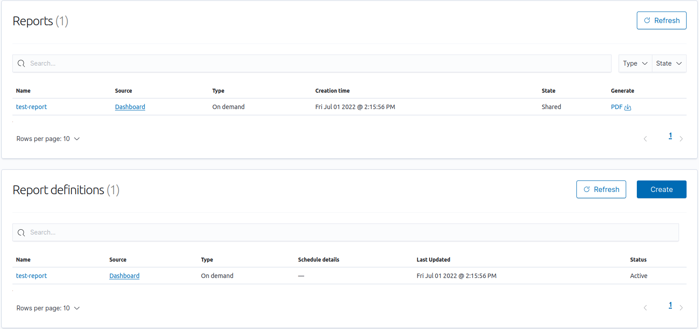
